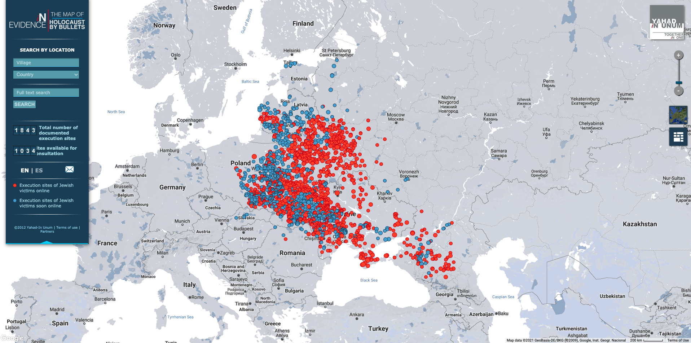

# “Holocaust by Bullets” Web Map Analysis
### Manya Rozet
#### March 2, 2020

The link to this project can be found [here](https://www.yahadmap.org/#map/).

The digital geographies project that I will be analyzing in depth is *Holocaust by Bullets*. It was created by an organization by the name of Yahad - In Unum, whose mission is to raise awareness of the various murders of Jewish and Romani people committed by Nazi mobile killing units in Eastern Europe during World War II. Yahad - In Unum was founded by Father Patrick Desbois in 2004.

The project is a **web map** which illustrates the horrifically large number of execution sites scattered across the region. The killings examined here are those carried out via *mass shootings*, and does not include the deaths that occurred in extermination camps. On their website, the organization claims that not only do they want their project to serve as a form of closure, they want it to exist as a means of **bringing awareness to modern day genocides**, many of which were modeled after Holocaust mass shootings and made use of their tactics. In effect, this makes the audience of this web map and project as a whole practically anyone, from students to educators to an average person seeking to learn more about the Holocaust and the dark history of genocide.

*Holocaust by Bullets* has been a multi-year project consisting of a variety of components. One of these is the **collection of eyewitness accounts** in order to assist in identifying the execution sites. These testimonies are central to the development of the digital map. In fact, there are video testimonies attached to specific execution sites available for any user of the digital map to view. Testimonies were collected during research trips taken by the organization from 2006 to 2016. In addition to the collection of accounts and the mapping project, Yahad - In Unum is partnered with two universities to contribute to the study of genocide.

The web map itself is a **dot distribution map**, with red dots symbolizing identified execution sites with information already posted online, and blue dots symbolizing identified execution sites with information soon to be posted. For the red dots, a user can interact with them by clicking on each. Upon clicking, the map disappears and a new screen appears, containing detailed information on the site. A user can browse through a slideshow of captioned photos of the sites and witnesses, as well as watch video interviews with the witnesses. A variety of other information exists on this page, such as the name of the town in which the executions occurred, what the site was prior to the war, whether or not memorials exist for the site, the years in which the town was occupied, the number of people that were killed, and much more. There are detailed historical notes on the town and the site, excerpts about the site from a variety of archives, and external links, such as one describing the organization’s research trip to the site.

The web map is centered on Eastern Europe. Elements of the web map include *two base maps with city names, one light-colored and the other a satellite view, a thematic layer representing the execution sites, a zoom function, a scale bar, and a legend*. There is also a search function in which a user can find a specific site based on the name of the village or country, or just by typing in keywords. There is an option to navigate to a *media wall*, which takes the user to a collection of photos and videos corresponding to a variety of sites. Clicking on them is another means by which a user can access the information for each execution site.

The web map connects to several external scripts, as well as the Google Fonts and Google Maps APIs. It also references a couple CSS style sheets. Some key features in the source code are ``<label>, <input>,`` and  ``<button>`` tags. The ``<label>`` and ``<input>`` tags allow a user to input search features and also input personal information for contact. This is because this project places a lot of emphasis on gathering data from their audience. They encourage their users to reach out if they have any information on a particular village or site. The ``<button>`` tag is used to interact with the web map - it allows a user to zoom in and out, switch base maps, access the media wall, and more. Several images are embedded, such as the Yahad - In Unum logo. Using the ``<a> href`` attribute, a data array called “en” streams from the server to the client. “En” stores information on every single data point, or village. The villages are each represented by one number in the array. In total, there are 2543 records. Each data point stores information on the village in an HTML file, including the name of the village, the country it is located in, the latitude and longitude, whether or not it is currently published with detailed information, and more.

Overall, the web map has a very simple and straightforward design. When first landing on the map, it is not too cluttered with information, and the way in which the interactive elements function is fairly clear. When a user hovers their cursor over the points on the map, there is a pop-up indicating the name of the town, with the cursor turning into a pointing hand, indicating the ability to click on the points. There are several features that are worth critiquing, however. It is not immediately clear why some points on the map direct you to a new screen explaining the details of the execution sites and some do not. It takes a moment of exploration to understand that the blue points are confirmed execution sites with information **not yet published** on the web map. The wording used to explain this - “soon online”, is not necessarily as straightforward as I believe it could be. While there may not be details available on these blue dots, I believe it is valuable to map them so as not to exclude any data.

Another problem that I noticed was that while there is an option to change the language of the map from English to Spanish on the legend that expands on the upper left-hand side, **this functionality does not actually work**, at least in a Google Chrome browser. On Safari, the language does indeed change, but only for parts of the website. Witness testimonies and historical notes for each execution site are not translated. My assumption is that this is a bug that has not been dealt with. It would be extremely useful to have multiple languages on the web map to allow for greater accessibility, but if this cannot be fixed soon to work across all browsers, I think it would be beneficial to remove the option from the map so as not to confuse the user. The feature would also be more serviceable if it translated every part of the website.

I also found a slight layout problem in the expandable legend, which is consistent across browsers. On the legend, located on the upper left-hand side, there are two numbers which list both the *total number of documented execution sites* and the *sites available for consultation*. The label for *sites available for consultation* is ever so slightly covered up by the number, and does not align with the label above it. This is a minor design flaw, which I believe could be easily fixed.

The last weakness of this web map that I will be discussing is also something I’d consider to be one of its strengths. In the end, this may come down to personal preference of a user and the reason for which they are using this map. The information on each execution site is **extremely detailed**. There are several dense paragraphs of witness interview transcriptions, historical notes, snippets from a variety of archives, and more. For a user who is simply wanting to gain some insight on the subject, the amount of reading may be slightly intimidating. I would consider this wordiness to be a drawback, especially for users that are part of the general public. Of course, if students or educators are using the web map as a resource, having a plethora of information could prove itself to be useful. In the same vein, having this amount of information signifies that the research was thorough, and probably does a good job of fulfilling the organization’s purpose, which is to educate people on genocide by mass shooting. My only concern is that users would only learn if they took the time to read all the captions, and many may not be willing to.

In my opinion, this web map presents itself as a form of **spatial activism**, and perhaps even **data feminism**. The second principle of data feminism is to **challenge power**, and this map does so by uncovering missing data and giving attention to a topic that otherwise could easily be overlooked (D’Ignazio, 2020). The existence of violent oppression and genocide is a dark reality, and it is not surprising that many, especially those privileged enough to be unaffected by it, would seek to hide from it or obscure the truth. In her article “Gwendolyn Warren and the Detroit Geographic Expedition and Institute”, Catherine D’Ignazio writes about the release of a map by the Detroit Geographic Expedition and Institute (DGEI) to illustrate the deaths of Black children by White drivers. The issue faced in the creation of this project was that much of the data and information was not publicly available. Existing power structures function to muffle the voices and lived realities of minorities, or those historically discriminated against. This map was produced as a form of resistance and in an attempt to highlight the continued existence of oppression and dominance of certain groups by others.

*Holocaust by Bullets* is a project that seeks to work towards justice by uncovering hidden information about the hundreds of thousands of people who were persecuted and violently killed during WWII. It also strives to educate on the systems of power in the world that allow for atrocities like genocide to occur.

References

D'Ignazio, C. (2020, February 12). Gwendolyn Warren and the Detroit Geographic Expedition and Institute. Retrieved March 02, 2021, from https://medium.com/nightingale/gwendolyn-warren-and-the-detroit-geographic-expedition-and-institute-df9ee10e6ad2
